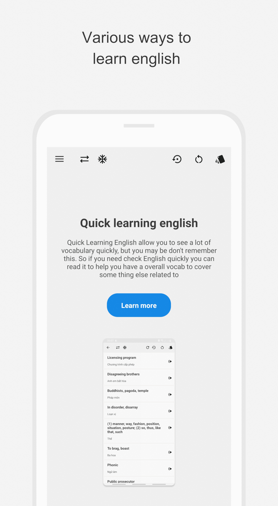

# IELearn
Let take a peaceful moment and write down your feeling

## Showcases

|||||
|:-----------------------:|:-----------------------:|:-----------------------:|:-----------------------:|
|||||

## Description
Learn English With Your Own Style And Custom Your Own Style In App.

What you can do in-app?
- You can learn vocabulary with a long list of vocabulary ( with some style as common vocabulary, advance vocabulary, ... ) also as common phrase.
- You can read story with its translate 
- And you can learn vocabulary in your own wallpaper if you like ( custom your wallpaper in the app )

 can you custom in app?
- You can custom almost every thing in the app such as text size, text font, text color, background, ... ( you can create your own theme with gradient color in the app, see the guide for more )
- You can custom your wallpaper like background wallpaper, and many properties in the app with your own way.

More feature will coming up later.
If you want to add any feature in future just give a feedback and I will consider it.